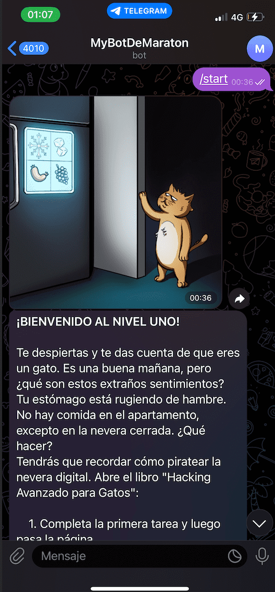
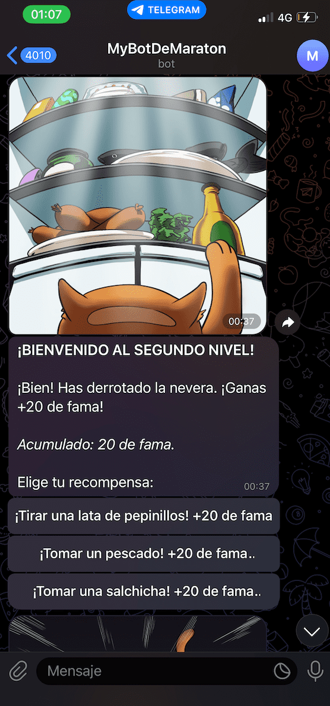

# java-telegram-bot

## Install

You need create a new bot with "BothFather" for set a name and get the token to access the HTTP API.

Then this data put in MyFirstTelegramBot class in the project.

```
  public static final String NAME = "MyBotName";
  public static final String TOKEN = "MyTokenAPI";
```

## Run Game

Then you need start the project, and use telegram (search the chat bot) for play the game.


<br>
<br>
